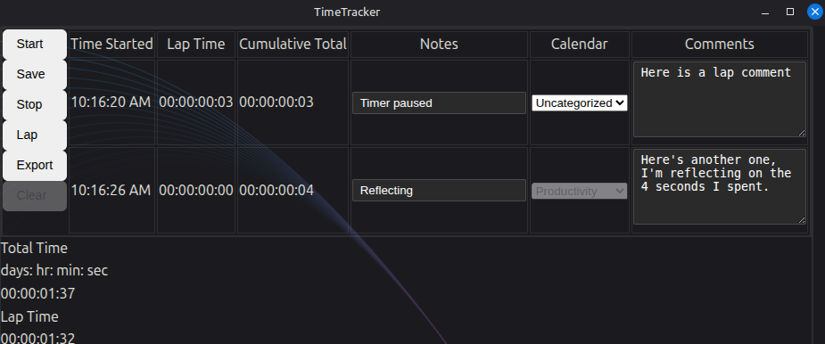
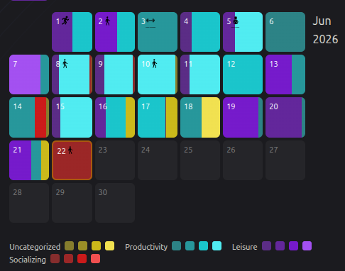
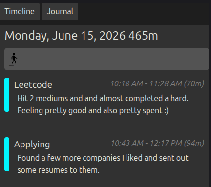
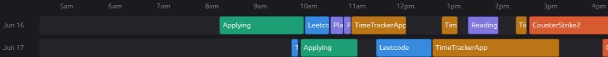
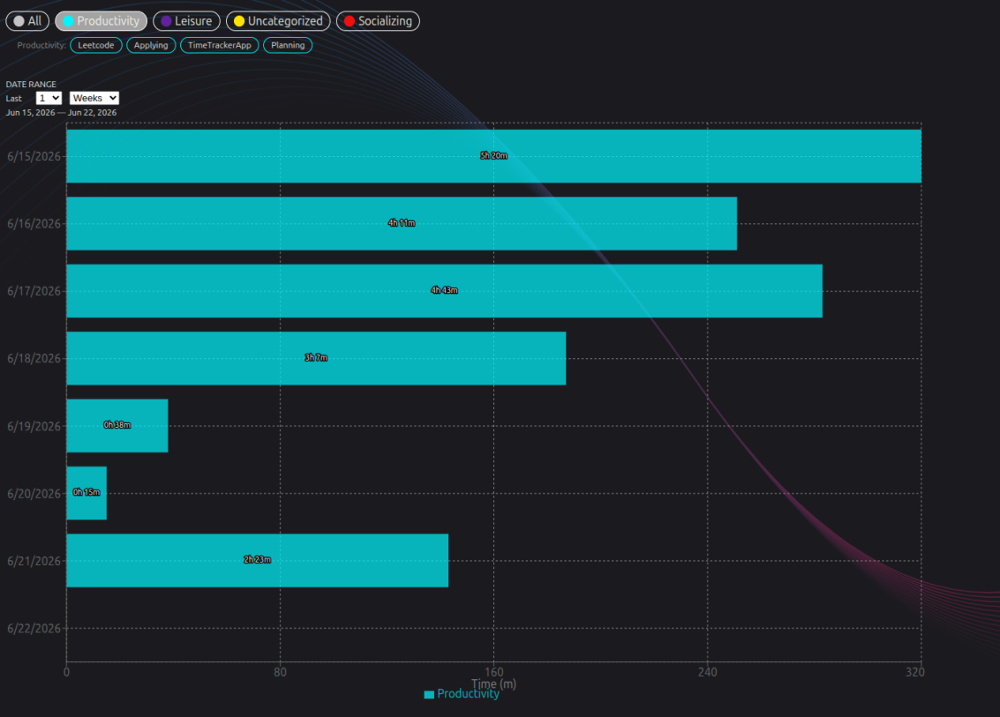

# Time Tracker

# Number of downloads

# Features

## Stopwatch

## Heatmap

Create 'Calendars' as sets of data where you want your lap data to go. They appear here as a heatmap of different widths to show how much of your day went to that calendar and as different shades to indicate how much time you spend that day in comparison to other days.

## Timeline

## Gantt charts

Get a visual feel for how much time you spend throughout your day in comparison to other tasks you are doing.

## Bar Chart

Time spent broken down by calendar, and then by activity. You can select multiple calendars to compare how much time is spent in each category.
